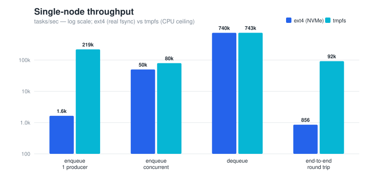
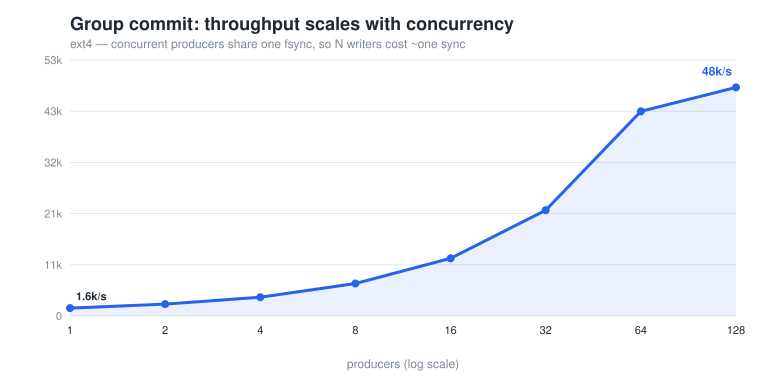
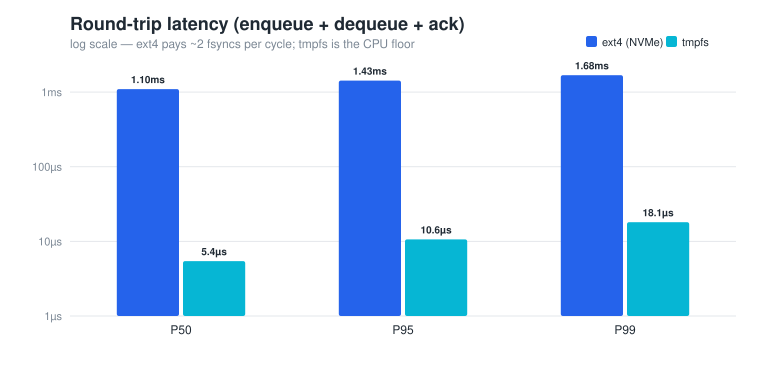
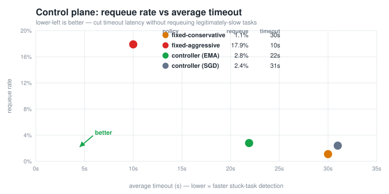

# distqueue

A distributed task queue in Go, built in three phases:

- **Single-node broker**: priority scheduling, a CRC-checked write-ahead
  log with crash recovery, group-committed fsyncs, at-least-once delivery
  with retries and a dead-letter queue, a gRPC API, and a worker SDK.
- **Raft-replicated cluster**: a from-scratch Raft implementation (leader
  election, log replication, snapshots — no etcd) replaces the WAL; the
  broker becomes a replicated state machine across 3 nodes. The history
  is verified linearizable with Porcupine while leaders are killed.
- **Adaptive control plane**: a Python feedback loop scrapes the broker's
  metrics and re-tunes it live (timeout / retries / workers) by writing a
  config the broker hot-reloads on SIGHUP — no restart, no dropped tasks.

```
Single node                          Cluster
-----------                          -------
Client                               Client (failover: follows the leader)
  |                                    |
  v  gRPC                              v  gRPC
[Broker]                       [node1: Leader] <--Raft--> [node2: Follower]
  | WAL (fsync + group commit)        |     \--Raft--->   [node3: Follower]
  | In-memory priority queue          |
  |                              On write: propose -> replicate to
  +--> Worker A --ack/nack-->         majority -> commit -> apply -> reply
  +--> Worker B --ack/nack-->
                                 Leader dies: new leader elected in ~200ms,
  Unacked -> timeout -> requeue       unacked tasks redelivered, acked
  N retries -> Dead Letter Queue      tasks never resurface
```

## Results

Measured on a 13th-gen Intel i7 (20 threads), Linux / ext4 on NVMe. Every
figure regenerates from `bash bench/run.sh && python3 bench/plot.py` — the
chart generator is hand-written SVG, standard library only, no plotting
dependencies.

### Throughput



Durability is real — every mutation is fsync'd *before* its ack — so a lone
producer is disk-bound (~1.6k tasks/sec). The WAL then **group-commits**:
concurrent producers share a single fsync, so throughput climbs with load.



1 → 128 producers: **1.6k → 48k tasks/sec on the same disk**, because N
writers cost roughly one sync (the trick PostgreSQL and etcd use). Dequeue
is pure in-memory at ~740k/sec.

| Path | ext4 (NVMe) | tmpfs (CPU ceiling) |
|---|---|---|
| Enqueue, 1 producer | 1.6k/s | 219k/s |
| Enqueue, concurrent | 50k/s | 80k/s |
| Dequeue | 740k/s | 743k/s |
| End-to-end (enqueue+dequeue+ack) | 856/s | 92k/s |

Replicated across a **3-node Raft cluster**: 672/s sequential, 873/s
concurrent; leader failover in ~200ms, node rejoin in ~2s. The consensus
tier is intentionally modest (whole-log persistence per write) — see
[DESIGN.md](DESIGN.md).

### Latency



Enqueue→dequeue→ack round trip: **P50 1.10ms / P99 1.68ms** on ext4 (two
fsyncs per cycle), ~5–18µs on tmpfs (the CPU floor).

### Adaptive tuning



| Policy | Requeue rate | Avg timeout |
|---|---|---|
| Fixed-conservative (30s) | 1.1% | 30.0s |
| Fixed-aggressive (10s) | 17.9% | 10.0s |
| **Controller (EMA)** | **2.8%** | **21.9s** |
| Controller (SGD) | 2.4% | 31.0s |

The EMA control loop keeps the safe policy's low requeue rate while cutting
average timeout **27%** — faster stuck-task detection without redelivering
slow-but-fine tasks the way a naive tight timeout does (18% of the time).
The optional scikit-learn SGD model *ties* the heuristic rather than beating
it — an honest result, explained in [Adaptive control plane](#adaptive-control-plane).

## Quickstart (single node)

```bash
go build -o bin/ ./cmd/...

# 1. Start the broker
./bin/broker --port 9000 --wal /tmp/demo.wal --task-timeout 10s

# 2. Enqueue some work
./bin/produce --broker localhost:9000 --count 100

# 3. Start a worker (4 concurrent handlers, 10% simulated failures)
./bin/worker --broker localhost:9000 --concurrency 4 --fail-rate 0.1

# 4. Watch the queue drain
./bin/produce --broker localhost:9000 --stats
# pending=37 in_flight=4 dlq=0 acked=59

# 5. Inspect anything that exhausted its retries
./bin/produce --broker localhost:9000 --dlq
```

## Quickstart (3-node Raft cluster)

```bash
# Or on one machine without Docker:
./bin/broker --cluster --node-id node1 --port 9001 --raft-port 8001 --data-dir data/node1 \
  --peers node2=localhost:8002=localhost:9002,node3=localhost:8003=localhost:9003 &
./bin/broker --cluster --node-id node2 --port 9002 --raft-port 8002 --data-dir data/node2 \
  --peers node1=localhost:8001=localhost:9001,node3=localhost:8003=localhost:9003 &
./bin/broker --cluster --node-id node3 --port 9003 --raft-port 8003 --data-dir data/node3 \
  --peers node1=localhost:8001=localhost:9001,node2=localhost:8002=localhost:9002 &

# Clients take all addresses and follow the leader automatically:
./bin/produce --broker localhost:9001,localhost:9002,localhost:9003 --count 100
./bin/worker  --broker localhost:9001,localhost:9002,localhost:9003 --concurrency 4
```

With Docker: `docker compose -f deploy/docker-compose.yml up --build`
brings up the 3 nodes plus Prometheus and a Grafana dashboard
(http://localhost:3000) showing the live leader, terms, queue depth, and
ack throughput. (Compose files are provided as-is; written but not yet
run on this machine — no Docker locally.)

## Leader-kill demo

Actual transcript — 100 tasks in flight, then `kill -9` on the leader:

```
$ ./bin/produce --broker <cluster> --count 100
enqueued 100 tasks
$ ./bin/produce --broker <cluster> --stats     # worker draining
pending=19 in_flight=2 dlq=0 acked=81
$ kill -9 <node2 pid>                          # node2 is the leader
# node3 wins the election ~200ms later; the worker rides through
$ ./bin/produce --broker <cluster> --stats
pending=0 in_flight=0 dlq=0 acked=100
```

All 100 tasks completed; the worker processed 102 deliveries — the 2
extras are the tasks that were in flight when the leader died, redelivered
by the new leader. That is the at-least-once contract working across
failover: **no acknowledged work is ever lost; duplicates are possible;
handlers must be idempotent.** A node restarted after an outage rejoins
and catches up in ~2s (snapshot + log replay).

## Crash recovery demo

Every mutation is fsync'd to the WAL before it is acknowledged, so
`kill -9` loses nothing that was acknowledged. Actual transcript:

```
$ ./bin/produce --count 200            # 200 tasks in, worker chewing through them
$ ./bin/produce --stats
pending=110 in_flight=2 dlq=0 acked=88
$ kill -9 <broker pid>                 # hard kill, no shutdown hook

$ ./bin/broker --wal demo/demo.wal     # restart on the same WAL
recovered from WAL: 112 pending, 0 dead-lettered

$ ./bin/produce --stats                # worker drains the recovered queue
pending=0 in_flight=0 dlq=0 acked=112
```

88 acked before the crash + 112 recovered = all 200 accounted for. The
2 tasks in flight at crash time were redelivered — the worker processed
202 tasks total for 200 enqueued, which is **at-least-once delivery**
working as specified: nothing lost, duplicates possible, so handlers
must be idempotent. See [DESIGN.md](DESIGN.md) for why dequeues are
deliberately not logged.

## Adaptive control plane

Static tuning is a guess: pin `task_timeout` too high and genuinely stuck
tasks sit undetected; pin it too low and you redeliver work that was just
slow. The control plane (`ml/`) closes the loop instead — it watches the
broker and adjusts.

```
broker :7000/metrics ──scrape──▶ collector ──▶ EMA / heuristic models
                                                      │ recommend
broker  ◀── SIGHUP ── config writer ◀── timeout / retries / workers
   └─ hot-reloads broker.conf (no restart, in-flight tasks untouched)
```

Every interval it scrapes the metrics, derives the failure signal
(`rate(queue_nacked_total) / rate(queue_acked_total)` — "is the timeout too
tight?"), and updates three controllers: an **EMA timeout** model (widens
under nack pressure, tightens when healthy), a **worker-count** estimator,
and a **retry** rule. When the recommendation changes it writes
`broker.conf` atomically and sends SIGHUP; the broker reloads in place.

It is honest about what it is: **EMA + heuristic controllers** (pure Python
standard library — no numpy/scikit-learn needed), with an optional
scikit-learn SGD upgrade (below). The point is the closed loop, not the
model sophistication.

```bash
# Broker with metrics + hot-reload wired up:
./bin/broker --port 9000 --metrics-port 7000 \
  --config broker.conf --pid-file broker.pid

# Drive the loop (stdlib only — no venv, no pip):
python3 ml/controller.py --metrics http://localhost:7000/metrics \
  --config broker.conf --pid-file broker.pid --interval 2 --min-samples 3
```

Live transcript — a worker failing 25% of tasks, controller reacting:

```
[controller] warming up (2/3) pending=0 ack/s=59.9 nack/s=20.97
[controller] pushed: timeout=33.2s workers=1 retries=2 (nack_pressure=0.390)
[controller] pushed: timeout=41.9s workers=1 retries=2 (nack_pressure=0.378)
[controller] pushed: timeout=40.1s workers=1 retries=3 (nack_pressure=0.000)
# broker.log: SIGHUP: config reloaded   (×10)
```

Under failure pressure it widened the timeout (33→42s) and trimmed retries
(3→2, since the failures were structural, not transient); when the queue
recovered it tightened back and restored the retry budget.

**Ablation** (`python3 ml/eval/replay.py`) — the chart and table are in
[Results](#adaptive-tuning). It's a closed-loop *simulation* with known
execution times (a policy comparison, not a measurement of a live run),
over a calm → load-spike → calm workload. The EMA controller keeps the
conservative policy's low requeue rate while cutting average timeout 27% —
it detects stuck tasks faster without redelivering legitimately-slow ones
during the spike, which the naive tight timeout does 18% of the time.

### Optional: scikit-learn SGD controller

`controller.py --timeout-model sgd` swaps the EMA rule for an
`SGDRegressor` trained offline (`ml/eval/train_sgd.py`) on simulation data
where the true p90 execution time is the label, then evaluated on
**held-out** load (unseen p90s and seed; ~5s MAE). It's gated behind
`ml/requirements-sgd.txt` and falls back to EMA if scikit-learn is absent —
the stdlib core is never burdened with the dependency.

The honest result (the SGD row in the ablation): **SGD matches the
conservative policy's safety but does *not* beat the EMA heuristic.** It
converges to a correct-
but-cautious timeout because at a loose setpoint almost nothing requeues —
the very signal that would tell it to tighten is absent, so it won't.
EMA's blind ratchet (tighten a little whenever it's quiet — a heuristic
justified by no observation) is exactly what wins the latency tradeoff
here. A clean illustration that a learned model is only as good as the
information in its features, and that a simple inductive bias can beat
supervised learning when the data can't supply that bias. Reported as-is.

## Benchmarks

Numbers and charts are in [Results](#results) above. Methodology, so the
figures are reproducible and honest:

- **Two storage targets.** fsync cost dominates, so every throughput/latency
  figure is run on **ext4 (NVMe)** — the real cost — and on **tmpfs**, where
  fsync is ~free, to expose the CPU-side ceiling. Benchmarks on `/tmp`
  (tmpfs) alone would report inflated durability numbers.
- **The group-commit curve** (`TestEnqueueScaling`) sweeps producer
  concurrency on ext4: a writer appends its record, then the first waiter
  fsyncs once for every record written before that sync started — so N
  concurrent writers cost ≈ one sync. Same approach as PostgreSQL and etcd;
  mechanism in [DESIGN.md](DESIGN.md).
- **Replicated** numbers come from a local 3-node cluster
  (`bench/cluster_throughput.sh`). A replicated write costs two fsyncs
  (leader + a follower) plus an RPC round trip, serialized by the simple
  whole-log-rewrite persistence the design starts with;
  [DESIGN.md](DESIGN.md) covers the optimization path (incremental log +
  batched group persist — the Phase 1 trick applied to Raft).

Run it yourself:

```bash
go test -bench . ./bench/                       # raw Go benchmarks
bash bench/run.sh && python3 bench/plot.py      # measure everything + redraw the charts
```

## Semantics

- **At-least-once delivery.** Acknowledged enqueues survive `kill -9` —
  of a single broker (WAL) or of the cluster leader (Raft majority). A
  task is redelivered if its worker dies, stalls past the task timeout,
  or the node serving it fails. Handlers must be idempotent.
- **Priority scheduling.** Lower number = higher priority; FIFO within
  a priority level.
- **Bounded retries.** A task that is nacked or times out `MaxRetries`
  times moves to the dead-letter queue, inspectable over the API. In
  cluster mode the retry counter is replicated state, so the DLQ verdict
  is deterministic on every node.
- **Torn-write safety.** Every WAL record carries a CRC32; a corrupt
  tail (crash mid-write) is truncated at the last valid record on
  recovery. Raft state is persisted with atomic temp-file + rename.
- **Compaction.** The WAL is periodically rewritten to live state; the
  Raft log is snapshotted and trimmed (lagging followers receive the
  snapshot via InstallSnapshot).

## Repository layout

```
broker/     queue core: priority queue, tracker, WAL, replicated state machine
raft/       Raft from scratch: election, replication, snapshots, persistence
proto/      gRPC API definitions (client API + raft RPCs)
gen/        generated protobuf/gRPC code (checked in)
server/     gRPC adapters: single-node server, cluster server, metrics
client/     failover client (follows the leader, rotates on node failure)
worker/     worker SDK (handler loop, backoff, concurrency)
cmd/        broker / worker / produce binaries
tests/      full-stack chaos + cluster failover tests
bench/      benchmarks
deploy/     Dockerfile, docker-compose (3 nodes + Prometheus + Grafana)
ml/         adaptive control plane (Python): collector, models, controller, eval
```

## Tests

```bash
go test -race ./...
```

- **Broker unit tests**: heap ordering, WAL roundtrip/replay/corruption,
  timeout redelivery, retry→DLQ promotion, concurrent-enqueue durability.
- **Raft suite** (`raft/`): election convergence and stability, minority
  partitions can't commit, deposed leaders' uncommitted entries are
  never applied, full-cluster restart, snapshot install and restart —
  with cross-node State Machine Safety checks.
- **Linearizability** (`raft/linearizability_test.go`): concurrent
  clients on a register over the raft package while leaders are killed;
  history checked with [Porcupine](https://github.com/anishathalye/porcupine),
  ambiguous timeouts modeled as open-ended operations.
- **Cluster chaos** (`tests/`): the real gRPC stack under leader kills —
  no accepted task lost, no acked task redelivered, restarts catch up.
- **Control plane** (`ml/tests/`, 23 stdlib `unittest` tests): Prometheus
  parsing + rate derivation, model behavior (timeout rises under nack
  pressure and clamps, retries cut when failing), atomic config writes, and
  the ablation's headline claim. Run: `python3 -m unittest discover -s ml/tests`.

## Observability

Every node exposes Prometheus metrics (`--metrics-port`): Raft term,
leader flag, log/commit/applied indexes, election count, queue depths,
ack/nack throughput. `deploy/` ships a Grafana dashboard wired to them, and
the control plane consumes the same endpoint.

## Possible next steps

- Pre-Vote (Raft §9.6) to stop rejoining nodes from inflating terms
- Incremental Raft log persistence with batched group persist
- Client session dedup for effectively-once enqueues
- Dynamic membership (joint consensus)
- Control plane: live worker auto-scaling (advisory today), per-task-type
  timeouts, cluster-mode hot-reload (config via Raft), the optional
  scikit-learn SGD timeout learner
